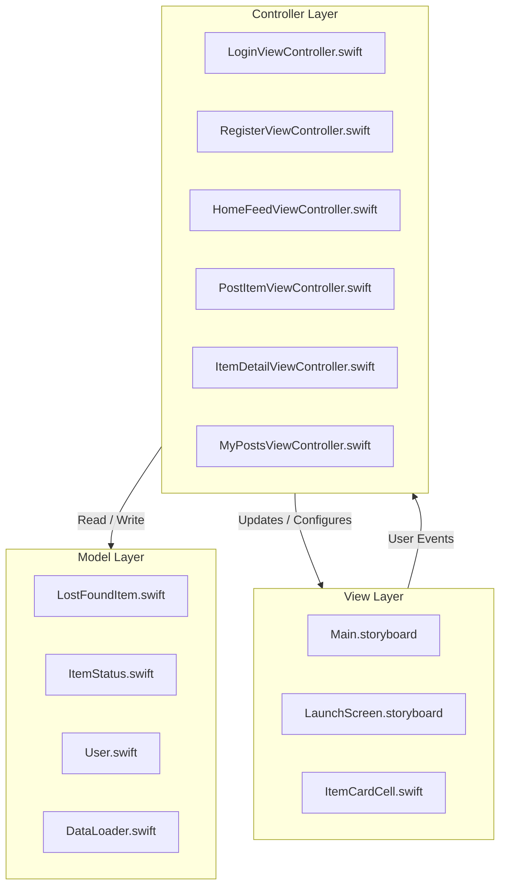

# System Architecture

ReturnIT is designed around the Model-View-Controller (MVC) architectural pattern. This document outlines how classes are structured, how data flows through the application, and how navigation is coordinated.

---

## 🏛️ MVC Pattern Mapping

The application's layers map directly to the files inside the folder structure:

### 1. Model Layer
* [LostFoundItem.swift](../ReturnIT/Models/LostFoundItem.swift): Defines the properties of an item, custom `Codable` decoding for field mapping, and identity fields.
* [ItemStatus.swift](../ReturnIT/Models/ItemStatus.swift): Type-safe enum detailing the lifecycle of an item (.lost, .found, .resolved).
* [User.swift](../ReturnIT/Models/User.swift): Data structure mapping user information.
* [DataLoader.swift](../ReturnIT/Services/DataLoader.swift): Core service singleton managing local file input/output and memory state caches.

### 2. View Layer
* [Main.storyboard](../ReturnIT/Storyboards/Main.storyboard): Contains the view definitions, UI layouts, and outlet connections.
* [ItemCardCell.swift](../ReturnIT/Views/ItemCardCell.swift): Custom card view that displays item summaries programmatically using Auto Layout.

### 3. Controller Layer
* [LoginViewController.swift](../ReturnIT/Controllers/LoginViewController.swift) & [RegisterViewController.swift](../ReturnIT/Controllers/RegisterViewController.swift): Manage user sessions and entry flow.
* [HomeFeedViewController.swift](../ReturnIT/Controllers/HomeFeedViewController.swift): Manages feed layout, delegates, table view datasources, and filter bar switches.
* [PostItemViewController.swift](../ReturnIT/Controllers/PostItemViewController.swift): Handles input forms, segment selections, category selection sheets, and image pickers.
* [ItemDetailViewController.swift](../ReturnIT/Controllers/ItemDetailViewController.swift): Renders detail pages and processes state modifications.

---

## 🔄 Data Flow: JSON to View

The life cycle of data in ReturnIT follows a unidirectional flow:

1. **Boot**: `DataLoader.shared` initializes. It looks for local sandbox files (`.items.json` and `.users.json`) in the documents folder.
   * If they do not exist, it loads bundled `items.json` from the resource catalog, decodes it into memory structures, and copies it to the documents folder.
2. **Retrieve**: View Controllers read data directly from the cached properties (`DataLoader.shared.items`).
3. **Format**: The Controller filters the array (e.g., matching category or status indices) and binds it to the table view.
4. **Display**: The cell (`ItemCardCell`) receives the model, reads titles/status tags, applies badge configurations, and updates labels.
5. **Update**: User actions (e.g. posting a new item, resolving an item) invoke write actions in the Controller, which saves changes to disk via `DataLoader.shared.saveItems()`.

---

## 🧭 Navigation Flow

The navigation hierarchy is controlled via a primary `UINavigationController` stack:

1. **Root View Controller**: `LoginViewController`
   * Navigates to `RegisterViewController` modally (full screen) if selected.
2. **Main Stack**: `HomeFeedViewController`
   * Pushed onto the navigation controller stack upon successful credential matching.
   * Disables back swipe/button navigation to lock the session.
3. **Detail Page**: `ItemDetailViewController`
   * Triggered exclusively programmatically inside `tableView(_:didSelectRowAt:)`.
   * Pushes details VC on the navigation controller stack.
4. **Submission Screen**: `PostItemViewController`
   * Triggered by Interface Builder segue connected to the floating action button (FAB), presenting a card modally.
